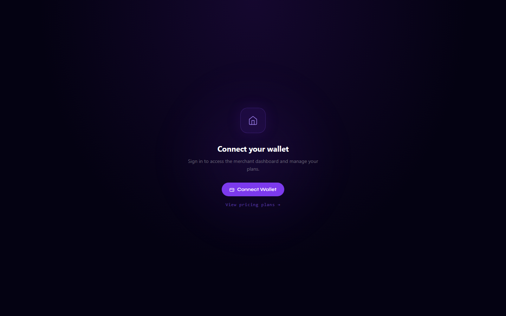

# Create a Plan

Merchants create subscription plans on-chain. Each plan has a name, price (in USDC), and billing interval.

---

## Via the Merchant Dashboard (Recommended)



1. Go to [starkpayhub.vercel.app/merchant](https://starkpayhub.vercel.app/merchant)
2. Connect your wallet
3. Click **Create Plan**
4. Fill in:
   - **Name** — e.g., "Pro", "Starter", "Enterprise"
   - **Price** — amount in USDC per billing period
   - **Interval** — Daily / Weekly / Monthly / Yearly
5. Sign the transaction

Your plan appears on the pricing page immediately after the transaction is confirmed.

---

## Via starkli CLI

```bash
# Create plan: name="Pro", price=15 USDC, interval=30 days (2592000 seconds)
starkli invoke \
  0x058a1e8058620d285047c7ee3df15804898070e6788fbffe004a29ffa554aa2c \
  create_plan \
  0x50726f \
  u256:15000000 \
  2592000

# Arguments:
#   name     = felt252 encoded string ("Pro" = 0x50726f)
#   price    = u256 in USDC micro-units (15 USDC = 15_000_000)
#   interval = seconds (86400=daily, 604800=weekly, 2592000=monthly, 31536000=yearly)
```

### Encode plan names to felt252

```bash
# Using starkli
starkli to-cairo-string "Pro"      # → 0x50726f
starkli to-cairo-string "Starter"  # → 0x537461727465
starkli to-cairo-string "Basic"    # → 0x4261736963
```

---

## Plan Limits (Tier System)

How many plans you can create depends on your merchant tier:

| Tier | Requirement | Plan Limit |
|---|---|---|
| Free | No subscription | 1 plan |
| Starter | Subscribe to Plan ID 1 | 3 plans |
| Pro | Subscribe to Plan ID 2 | 10 plans |
| Enterprise | Subscribe to Plan ID 3 | Unlimited |

See [Tier System](tier-system.md) for details.

---

## Plan Parameters

| Field | Type | Description |
|---|---|---|
| `name` | `felt252` | Short string (max 31 chars). Stored on-chain |
| `price` | `u256` | USDC amount in micro-units (6 decimals). `$15 = 15_000_000` |
| `interval` | `u64` | Billing interval in seconds |
| `active` | `bool` | Auto-set to `true` on creation. Can be deactivated |

---

## Common Intervals

| Label | Seconds |
|---|---|
| Daily | `86400` |
| Weekly | `604800` |
| Monthly (30 days) | `2592000` |
| Yearly (365 days) | `31536000` |
