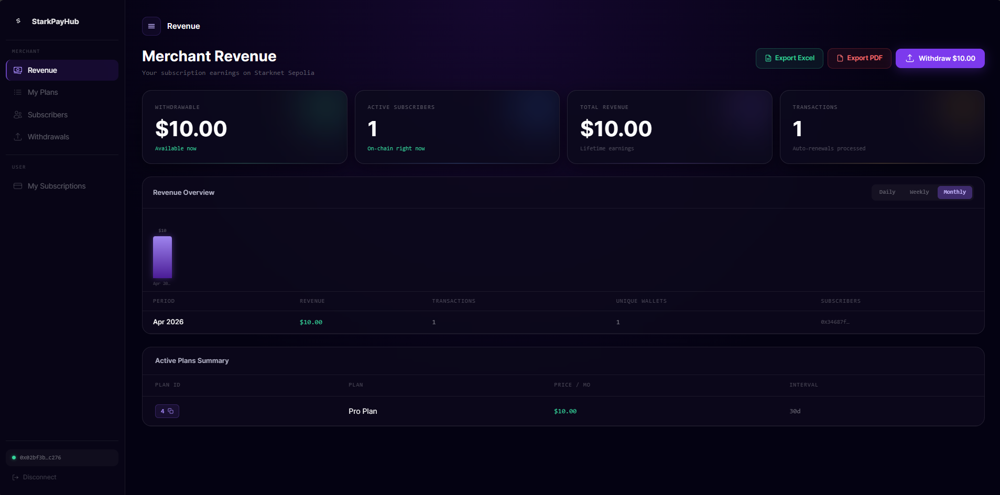

# Merchant Dashboard

The merchant dashboard is available at [starkpayhub.vercel.app/merchant](https://starkpayhub.vercel.app/merchant). Connect your wallet to view your stats.



---

## Dashboard Metrics

| Metric | Description |
|---|---|
| **Total Revenue** | Lifetime USDC received from all subscribers |
| **Withdrawable** | USDC currently available to withdraw to your wallet |
| **Active Subscribers** | Number of currently active subscriptions |
| **Total Transactions** | Total payment events processed by the contract |

---

## Revenue Breakdown

The dashboard shows per-plan breakdowns so you can see which plans generate the most revenue.

---

## Export Revenue Report

Download a PDF report of your revenue stats via the **Export Report** button. The report includes:
- Merchant address
- Total revenue and withdrawable balance
- Subscriber count and transaction history
- Export timestamp

---

## Real-Time Data

All stats are read directly from the smart contract — no database, no API. Data updates automatically as new payments are processed by the keeper bot.

---

## Programmatic Access (SDK)

```tsx
import { useMerchantStats } from '@starkpay/sdk'
import { useAccount } from '@starknet-react/core'

function Dashboard() {
  const { address } = useAccount()
  const { stats, isLoading } = useMerchantStats(address)

  if (isLoading || !stats) return <p>Loading...</p>

  const fmt = (n: bigint) => `$${(Number(n) / 1_000_000).toFixed(2)}`

  return (
    <div>
      <p>Revenue: {fmt(stats.totalRevenue)}</p>
      <p>Withdrawable: {fmt(stats.withdrawable)}</p>
      <p>Subscribers: {stats.activeSubs.toString()}</p>
      <p>Transactions: {stats.txCount.toString()}</p>
    </div>
  )
}
```

See [Hooks → useMerchantStats](../sdk/hooks.md#usemerchnantstats) for full API reference.
