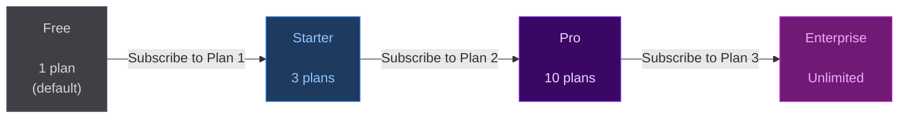

# Merchant Tier System

StarkPayHub uses its own subscription protocol to gate merchant features. To create more than one plan, you need to subscribe to a StarkPayHub plan yourself — the protocol eats its own dog food.

---

## Tier Overview

| Tier | How to Unlock | Max Plans You Can Create |
|---|---|---|
| **Free** | Default (no subscription needed) | 1 plan | — |
| **Starter** | Subscribe to Plan ID 1 ($10/mo) | 3 plans | — |
| **Pro** | Subscribe to Plan ID 2 ($30/mo) | 10 plans | — |
| **Enterprise** | Subscribe to Plan ID 3 ($99/mo) | Unlimited | Gasless for subscribers |

---

## Tier Progression



---

## How It's Enforced


This check happens **on-chain** — it cannot be bypassed.

---

## Read Your Current Tier

### Via SDK

```tsx
import { useMerchantTier } from '@starkpay/sdk'
import { useAccount } from '@starknet-react/core'

function TierBadge() {
  const { address } = useAccount()
  const { tier, planCount, planLimit, canCreatePlan } = useMerchantTier(address)

  return (
    <div>
      <p>Tier: {tier}</p>
      <p>Plans: {planCount} / {planLimit === Infinity ? '∞' : planLimit}</p>
      {!canCreatePlan && (
        <p>⚠️ Plan limit reached. Upgrade your tier to create more plans.</p>
      )}
    </div>
  )
}
```

### Return values

| Field | Type | Description |
|---|---|---|
| `tier` | `'free' \| 'starter' \| 'pro' \| 'enterprise'` | Current merchant tier |
| `planCount` | `number` | Plans created so far |
| `planLimit` | `number` | Max plans for this tier |
| `canCreatePlan` | `boolean` | `planCount < planLimit` |

---

## Upgrade Your Tier

To move from Free → Starter, subscribe to **Plan ID 1** on the pricing page. The tier upgrade takes effect immediately after your subscription is confirmed on-chain.

This creates a recursive use of the protocol: merchants pay StarkPayHub in USDC to unlock higher plan limits, just like their own users pay them.

---

## Enterprise Exclusive: Gasless Subscriptions

Enterprise tier merchants get an additional benefit: **their subscribers pay zero gas**. When a developer enables `gasless={true}` in the SDK, StarkPayHub automatically checks on-chain whether the plan's merchant is on Enterprise tier.

- **Enterprise merchant** → gas is sponsored by AVNU Paymaster → user pays only USDC
- **Non-Enterprise merchant** → SDK falls back to normal execution → user pays gas

This happens transparently — no API key or extra setup needed from the developer. Just add `gasless` to the provider:

```tsx
<StarkPayProvider gasless>
  <App />
</StarkPayProvider>
```

> Gasless sponsorship is available on **Sepolia testnet** (free, unlimited). Mainnet sponsorship uses AVNU credits.

---

## What Happens When Your Tier Subscription Expires

If your StarkPay tier subscription expires and you have more active plans than the free tier allows (1 plan), your **revenue withdrawal will be blocked** until you renew.

- Your plans keep running normally — subscribers are not affected
- Revenue keeps accumulating in the contract
- You just cannot withdraw until your tier is renewed

To unblock withdrawal, simply re-subscribe to your tier plan. The block lifts immediately.

> **Your funds are always safe.** The contract owner cannot access merchant balances. The withdrawal block exists to prevent merchants from creating plans on a paid tier, letting it expire, and continuing to collect revenue for free.
