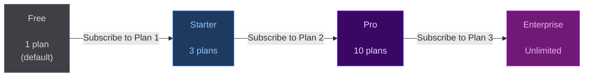
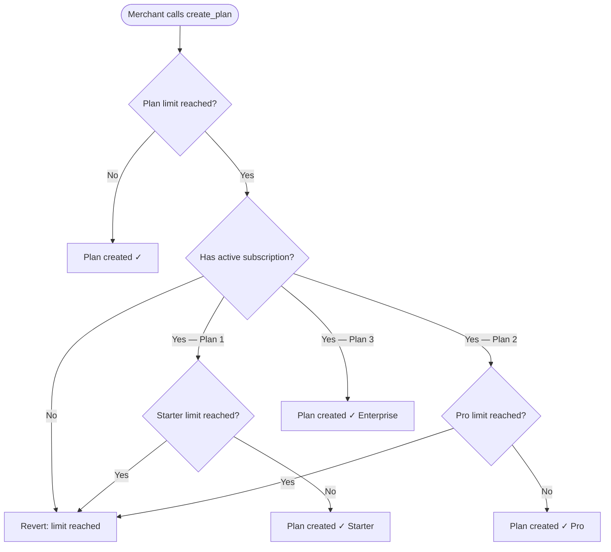

# Merchant Tier System

StarkPayHub uses its own subscription protocol to gate merchant features. To create more than one plan, you need to subscribe to a StarkPayHub plan yourself — the protocol eats its own dog food.

---

## Tier Overview

| Tier | How to Unlock | Max Plans You Can Create |
|---|---|---|
| **Free** | Default (no subscription needed) | 1 plan |
| **Starter** | Subscribe to Plan ID 1 | 3 plans |
| **Pro** | Subscribe to Plan ID 2 | 10 plans |
| **Enterprise** | Subscribe to Plan ID 3 | Unlimited |

---

## Tier Progression



---

## How It's Enforced



This check happens **on-chain** — it cannot be bypassed.

---

## Read Your Current Tier

### Via SDK

```tsx
import { useMerchantTier } from '@starkpay/sdk'
import { useAccount } from '@starknet-react/core'

function TierBadge() {
  const { address } = useAccount()
  const { tier, planCount, planLimit, canCreatePlan } = useMerchantTier(address)

  return (
    <div>
      <p>Tier: {tier}</p>
      <p>Plans: {planCount} / {planLimit === Infinity ? '∞' : planLimit}</p>
      {!canCreatePlan && (
        <p>⚠️ Plan limit reached. Upgrade your tier to create more plans.</p>
      )}
    </div>
  )
}
```

### Return values

| Field | Type | Description |
|---|---|---|
| `tier` | `'free' \| 'starter' \| 'pro' \| 'enterprise'` | Current merchant tier |
| `planCount` | `number` | Plans created so far |
| `planLimit` | `number` | Max plans for this tier |
| `canCreatePlan` | `boolean` | `planCount < planLimit` |

---

## Upgrade Your Tier

To move from Free → Starter, subscribe to **Plan ID 1** on the pricing page. The tier upgrade takes effect immediately after your subscription is confirmed on-chain.

This creates a recursive use of the protocol: merchants pay StarkPayHub in USDC to unlock higher plan limits, just like their own users pay them.
