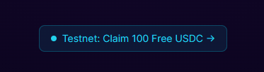

# Claim Testnet USDC

StarkPayHub runs on **Starknet Sepolia Testnet**. Payments use a MockUSDC token that can be freely minted — no real money involved.

---

## Option 1 — Use the Frontend (Easiest)



1. Go to [starkpayhub.vercel.app/pricing](https://starkpayhub.vercel.app/pricing)
2. Connect your wallet
3. Click **"Testnet: Claim 100 Free USDC →"**
4. Confirm the transaction in your wallet
5. Wait ~10 seconds for confirmation

You'll receive **100 USDC** (100,000,000 in micro-units) in your wallet.

---

## Option 2 — Via starkli CLI

```bash
starkli invoke \
  0x03f2e44f91a2994b1748473aebe2512a280a4ada60df57d31886d3faf95a0776 \
  mint \
  <YOUR_WALLET_ADDRESS> \
  u256:100000000

# Mints 100 USDC to your address
# u256 calldata: [low, high] — for values < 2^128, high = 0
```

---

## Option 3 — Direct Contract Call on Voyager

1. Go to the [MockUSDC contract on Voyager](https://sepolia.voyager.online/contract/0x03f2e44f91a2994b1748473aebe2512a280a4ada60df57d31886d3faf95a0776)
2. Click **Write** → find `mint`
3. Enter your wallet address and amount `100000000`
4. Execute and sign

---

## USDC Decimals

MockUSDC uses **6 decimal places**, identical to real USDC on Ethereum/Starknet:

| You see | On-chain |
|---|---|
| 1 USDC | `1000000` |
| 100 USDC | `100000000` |

---

## Gas Fees

You need a small amount of ETH or STRK on Sepolia to pay transaction gas.

→ [faucet.starknet.io](https://faucet.starknet.io) — claim free Sepolia ETH and STRK
