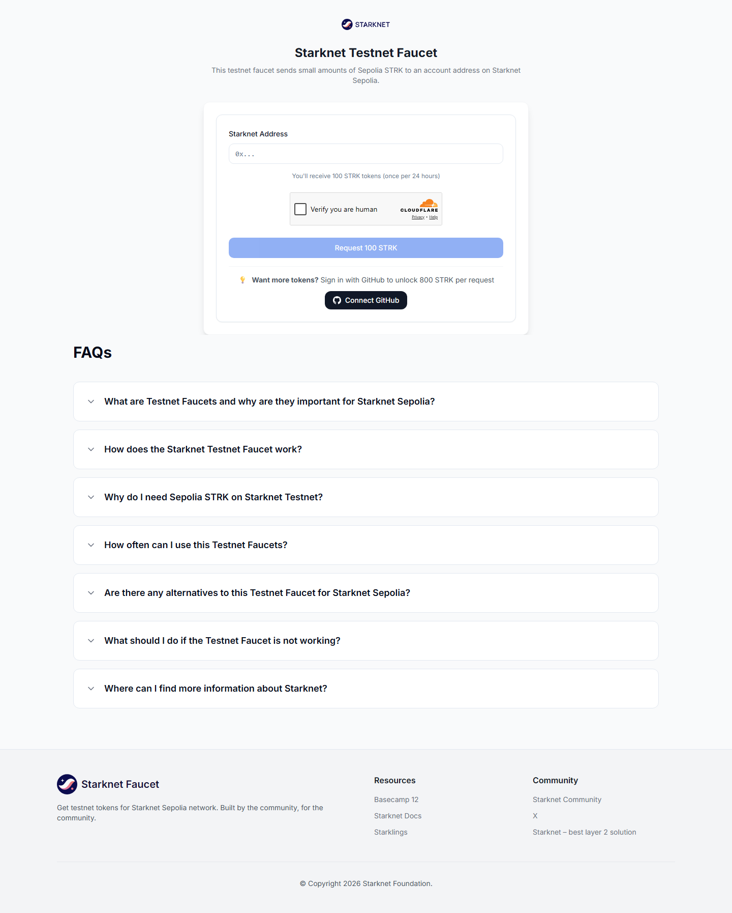

# Connect Your Wallet

StarkPayHub works with Starknet-native wallets. You need one of these browser extensions installed.

---

## Supported Wallets

| Wallet | Network | Install |
|---|---|---|
| **Argent X** | Sepolia Testnet + Mainnet | [Chrome Web Store →](https://chrome.google.com/webstore/detail/argent-x/dlcobpjiigpikoobohmabehhmhfoodbb) |
| **Argent Web Wallet** | Mainnet only | [app.argent.xyz →](https://app.argent.xyz) |
| **Braavos** | Sepolia Testnet + Mainnet | [Chrome Web Store →](https://chrome.google.com/webstore/detail/braavos-smart-wallet/jnlgamecbpmbajjfhmmmlhejkemejdma) |

> **Note**: MetaMask and other Ethereum wallets are not supported. Starknet uses a different account model.

> **Argent Web Wallet** does not require a browser extension — it runs entirely in the browser. However, it only supports Starknet Mainnet; use Argent X or Braavos for Sepolia Testnet.

---

## Step by Step

### 1. Install a wallet extension

Download and install Argent X or Braavos from the Chrome Web Store. Follow the extension's onboarding to create a new account.

### 2. Add Starknet Sepolia Testnet

Both wallets include Sepolia Testnet by default. Make sure you switch to **Sepolia** in the network selector (not Starknet Mainnet).

### 3. Get gas tokens

You need a small amount of ETH or STRK on Sepolia to pay gas fees.

→ Claim free testnet tokens at [faucet.starknet.io](https://faucet.starknet.io)

### 3. Get gas tokens

You need a small amount of ETH or STRK on Sepolia to pay gas fees.

→ Claim free testnet tokens at [faucet.starknet.io](https://faucet.starknet.io)

### 4. Connect to StarkPayHub

Click **Connect Wallet** in the top-right corner of [starkpayhub.vercel.app](https://starkpayhub.vercel.app). Your wallet extension will prompt you to approve the connection.

---

## Troubleshooting

**The "Connect Wallet" button does nothing**

Make sure Argent X or Braavos is installed and unlocked. The button detects the wallet extension automatically.

**Wrong network error**

Switch your wallet to Starknet Sepolia Testnet. Look for the network selector inside your wallet extension.

**Transaction fails immediately**

You may not have enough ETH/STRK for gas. Claim from the [Starknet Faucet](https://faucet.starknet.io).
