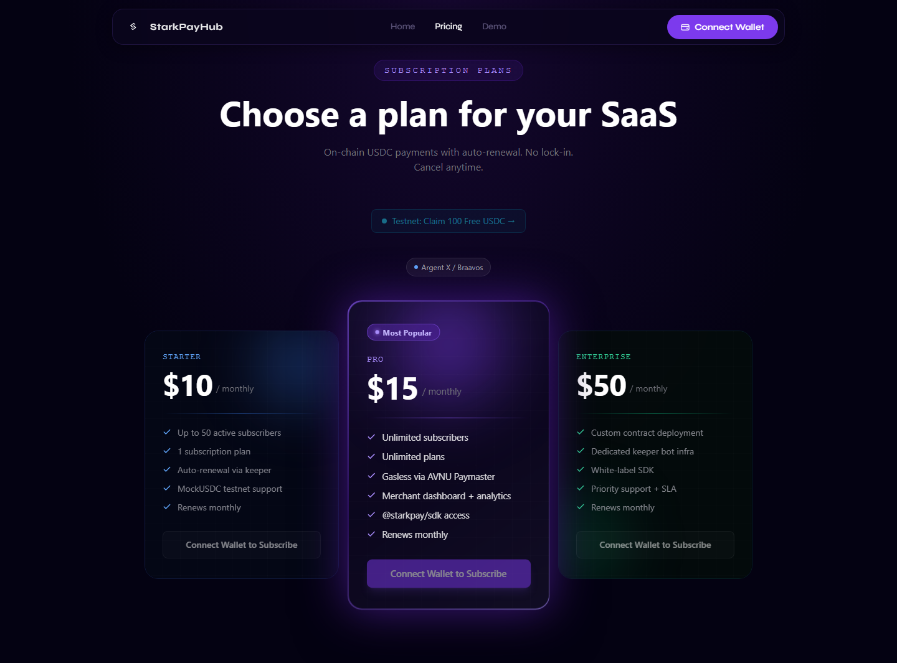
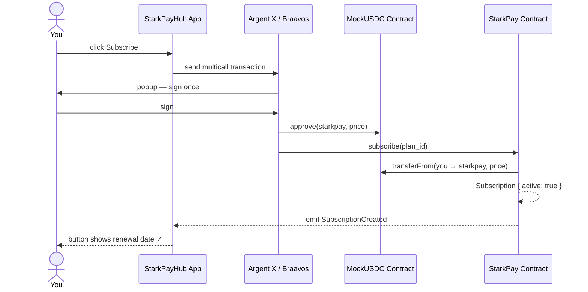
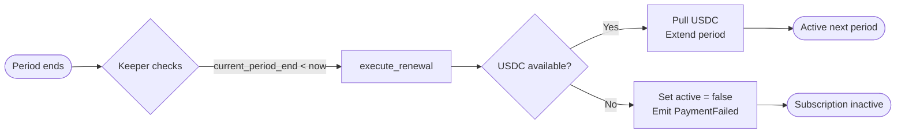

# Subscribe to a Plan

---

## How to Subscribe

1. **Connect your wallet** — Argent X or Braavos (see [Connect Your Wallet](connect-wallet.md))
2. **Have USDC** — On Sepolia, claim free test USDC from the pricing page (see [Claim Testnet USDC](claim-testnet-usdc.md))
3. **Go to the Pricing page** — [starkpayhub.vercel.app/pricing](https://starkpayhub.vercel.app/pricing)

4. **Click Subscribe** on the plan you want
5. **Sign the transaction** in your wallet popup — a single signature approves the USDC and subscribes in one multicall

That's it. Your subscription is active immediately.

---

## What Happens Step by Step

---

## Auto-Renewal Flow

**Make sure you have enough USDC in your wallet before the renewal date.** If you don't have sufficient balance, the renewal fails — your subscription becomes inactive and you lose access.

---

## Cancel Anytime

You can cancel your subscription at any time from the pricing page or your subscription dashboard. Cancellations are on-chain and take effect immediately. There are no penalties or fees.

After cancellation, you retain access until the end of the current billing period (the USDC you already paid for).

---

## Check Your Subscription Status

Your subscription status is visible on the pricing page — the "Subscribe" button changes to show your plan's next renewal date when you're active.

You can also check directly on Voyager by reading the contract state at the [StarkPay contract address](https://sepolia.voyager.online/contract/0x058a1e8058620d285047c7ee3df15804898070e6788fbffe004a29ffa554aa2c).
