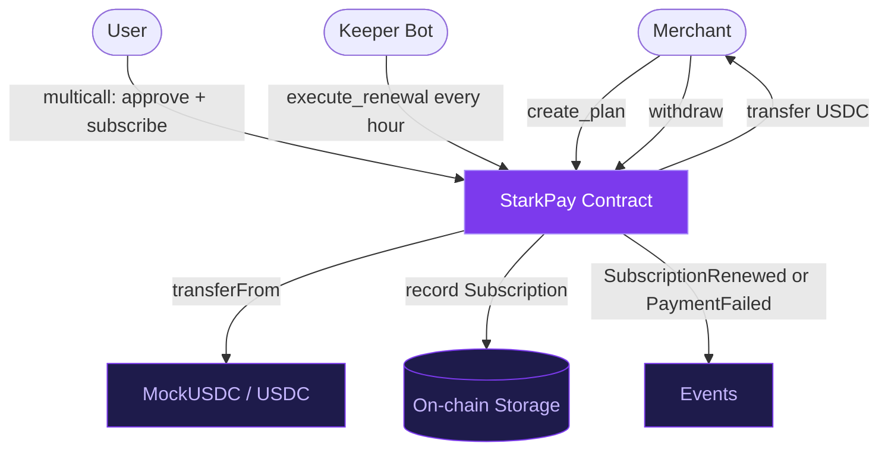
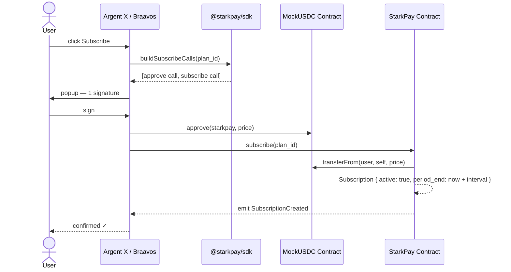
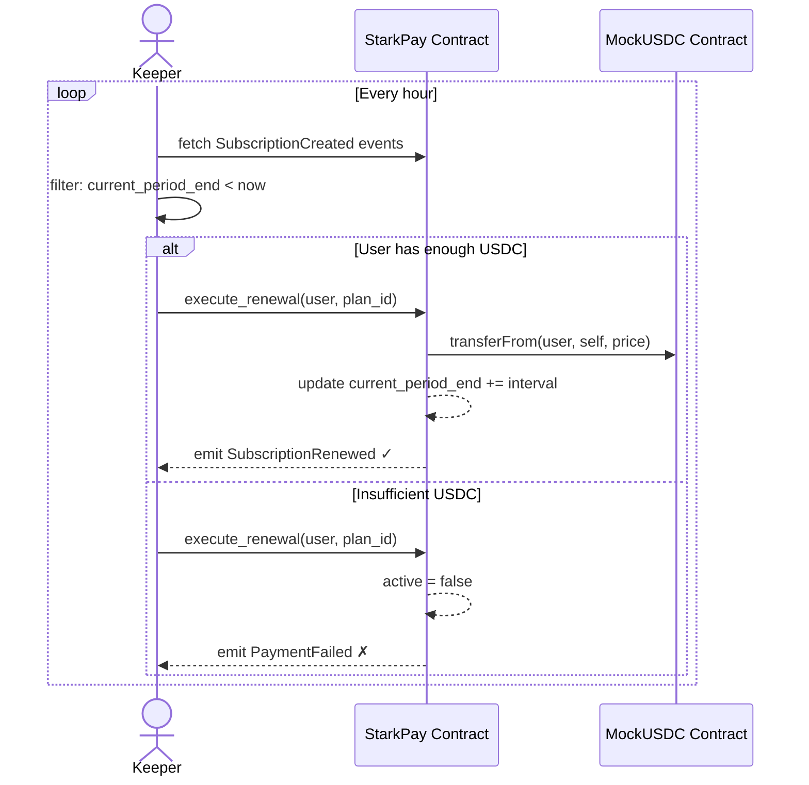

# How It Works

## System Overview

---

## Three Actors

### 1. Merchant
Creates subscription plans via the dashboard or CLI. Plans have a name, price (in USDC), and billing interval (daily / weekly / monthly / yearly).

Once subscribers start paying, the merchant can withdraw their accumulated USDC balance at any time.

### 2. User (Subscriber)
Connects their Argent X or Braavos wallet. Subscribes to a plan with a single multicall transaction. Can cancel at any time — no lock-in.

### 3. Keeper Bot
A permissionless bot that anyone can run. It reads `SubscriptionCreated` events from the chain, finds subscriptions where `current_period_end < now`, and calls `execute_renewal(user, plan_id)` to charge the next period.

Crucially, `execute_renewal` **does not revert on failure** — if a user has insufficient USDC, it emits a `PaymentFailed` event and moves on. This lets the keeper batch renewals for hundreds of users in one run.

---

## Subscribe Flow

---

## Renewal Flow

---

## Multicall = One Signature

The key UX feature: approve + subscribe happen in a single Starknet multicall transaction. The user is shown one popup and signs once. Under the hood, the contract receives the approval and the subscription call atomically.

This is possible because Starknet's account model supports multicall natively — all accounts on Starknet can batch calls.

---

## USDC Denomination

All prices use **6 decimal places**, same as standard USDC:

| Display | On-chain value |
|---|---|
| $1.00 | `1_000_000` |
| $5.00 | `5_000_000` |
| $15.00 | `15_000_000` |
| $50.00 | `50_000_000` |
