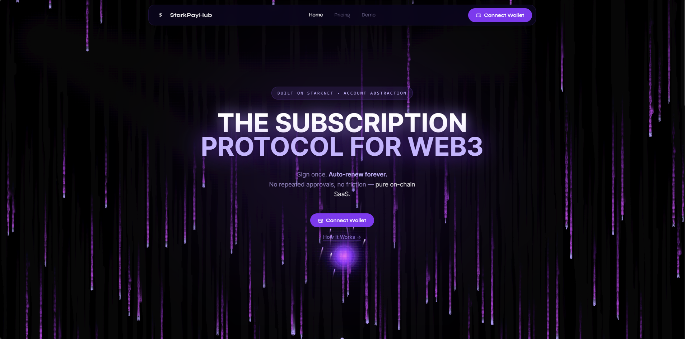

# What is StarkPayHub?

StarkPayHub is an **on-chain subscription payment protocol** built on Starknet. It enables SaaS products to accept recurring USDC payments directly on-chain — no payment processors, no custodians, no lock-in.



> **Note:** The `@starkpay/sdk` is designed for **React-based** frameworks (Next.js, Vite + React, Remix). If you're using Vue, Svelte, or Angular, you can still interact with the protocol directly via [`starknet.js`](https://starknetjs.com/) — see [Framework Support](#framework-support) below.

---

## Core Problem

Traditional subscription billing (Stripe, Paddle, etc.) requires:
- A centralized entity to process and hold funds
- KYC/AML verification for merchants
- Chargeback risk and platform dependency
- Fiat off-ramps and settlement delays

StarkPayHub removes all of this. Payments go directly from subscriber wallet → merchant wallet, enforced by an immutable smart contract.

---

## What Makes It Different

### Native Account Abstraction
Starknet's Account Abstraction allows users to sign a subscription once and have renewals execute automatically — without pre-approving unlimited spending or trusting a third party.

### One Transaction for Subscribe
The SDK bundles USDC approval + subscription into a single multicall transaction. Users click once, sign once, done.

### Gasless Subscriptions
With AVNU Paymaster integration, users can subscribe without holding ETH for gas. They only pay USDC — the gas is sponsored automatically.

### Non-Custodial
Merchant funds sit in the smart contract until the merchant withdraws. No one else can touch them. The contract has no admin key.

### Auto-Renewal via Keeper
A keeper bot monitors all active subscriptions and calls `execute_renewal` when a period ends. If the user has insufficient USDC, the renewal fails gracefully — it does not revert, does not block other renewals.

---

## Who Is It For?

| Audience | Use Case |
|---|---|
| **SaaS Developers** | Integrate crypto subscription payments into any React/Next.js app with 3 lines of code |
| **Merchants** | Create plans, manage subscribers, withdraw revenue — all from a dashboard |
| **Users** | Subscribe to SaaS products using USDC on Starknet; cancel anytime |
| **Protocol Builders** | Fork or extend the Cairo contracts for your own use case |

---

## What's Included

| Component | Description |
|---|---|
| **Smart Contracts** (Cairo) | `StarkPay.cairo` — the subscription protocol; `MockUSDC.cairo` — testnet token |
| **`@starkpay/sdk`** | React SDK — components, hooks, call builders, MCP server |
| **Frontend** (Next.js) | Live demo at [starkpayhub.vercel.app](https://starkpayhub.vercel.app) |
| **Keeper Bot** (Node.js) | Auto-renewal daemon deployed via Vercel Cron |

---

## Framework Support

### SDK (`@starkpay/sdk`) — React Only

The SDK uses React hooks and JSX components. It works with any **React-based** framework:

| Framework | Support | Notes |
|---|---|---|
| **Next.js** (App Router) | ✅ Full | Recommended |
| **Next.js** (Pages Router) | ✅ Full | |
| **Vite + React** | ✅ Full | Add `resolve.dedupe` in vite config |
| **Remix** | ✅ Full | |
| **Create React App** | ✅ Full | |
| **Gatsby** | ✅ Full | |

### Non-React Frameworks — Use `starknet.js` Directly

If you're using Vue, Svelte, Angular, or plain JS, you **cannot use the SDK hooks/components** — but you can still integrate with the StarkPay protocol directly using `starknet.js`:

| Framework | SDK | Protocol via starknet.js |
|---|---|---|
| **Vue / Nuxt** | ❌ | ✅ Manual integration |
| **Svelte / SvelteKit** | ❌ | ✅ Manual integration |
| **Angular** | ❌ | ✅ Manual integration |
| **Plain HTML/JS** | ❌ | ✅ Manual integration |

For manual integration, you call the contract functions directly:

```js
import { RpcProvider, Contract, Account, CallData } from "starknet"

const provider = new RpcProvider({ nodeUrl: "https://..." })
const account  = new Account(provider, address, privateKey)

// Subscribe to a plan
await account.execute([
  {
    contractAddress: USDC_ADDRESS,
    entrypoint: "approve",
    calldata: CallData.compile({ spender: STARKPAY_ADDRESS, amount: price }),
  },
  {
    contractAddress: STARKPAY_ADDRESS,
    entrypoint: "subscribe",
    calldata: CallData.compile({ plan_id: planId }),
  },
])
```

See [Contract Functions](../smart-contracts/contract-functions.md) for the full list of available functions.

---

## Network

Currently live on **Starknet Sepolia Testnet**. Mainnet deployment after audit.
