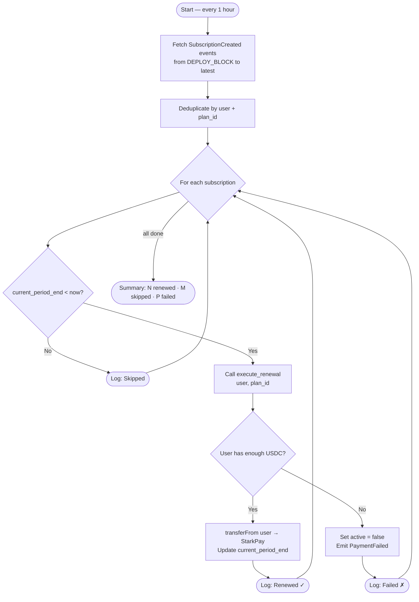
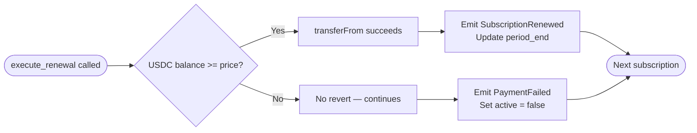

# Keeper Bot Overview

The keeper bot is a Node.js process that runs continuously and triggers subscription renewals on-chain.

---

## What It Does



Sample output:

```
🔁 Starting keeper in loop mode (every 1 hour)
🔄 Keeper running at 2026-04-16T10:00:00Z
   StarkPay: 0x058a1e...
   Keeper:   0x...
📡 Fetching SubscriptionCreated events...
   Found 5 unique subscriptions
✅ Renewed user=0xabc plan=1 tx=0x...
⏭️  Skipped user=0xdef plan=1 (not expired)
❌ Failed user=0x123 plan=2 (Insufficient balance)
📊 Done: 1 renewed, 3 skipped, 1 failed
```

---

## Why Permissionless?

`execute_renewal` can be called by **anyone** — there's no whitelist. This means:
- Anyone can run a keeper for the protocol (decentralized)
- If the official keeper goes down, users or third parties can step in
- The keeper wallet only needs gas (ETH/STRK), not special permissions

---

## What Happens on Renewal Failure?



This design allows one keeper to handle thousands of renewals without a single failure blocking others.

---

## Running the Keeper

### One-time run (for Vercel Cron)

```bash
pnpm start
```

### Loop mode (for Railway / VPS)

```bash
pnpm start:loop
# Runs every hour indefinitely
```

---

## Environment Variables

| Variable | Description |
|---|---|
| `KEEPER_PRIVATE_KEY` | Private key of the keeper wallet |
| `KEEPER_ADDRESS` | Address of the keeper wallet |
| `STARKPAY_ADDRESS` | StarkPay contract address |
| `STARKNET_RPC` | Starknet RPC endpoint URL |
| `DEPLOY_BLOCK` | Block number to start scanning events from |
| `MODE` | `loop` for continuous, omit for single run |

---

## Gas Costs

Each `execute_renewal` call costs less than **0.001 STRK** on Sepolia. The keeper wallet needs a small STRK/ETH balance to cover gas.

Claim Sepolia gas at [faucet.starknet.io](https://faucet.starknet.io).

---

## Vercel Cron Integration

The keeper is also available as a Vercel Cron route at `/api/keeper`, scheduled to run daily:

```json
// vercel.json
{
  "crons": [
    {
      "path": "/api/keeper",
      "schedule": "0 0 * * *"
    }
  ]
}
```

> Note: Vercel Hobby plan supports daily cron only. For hourly renewals, deploy the keeper bot on Railway (see [Deployment Guide](deployment.md)).
