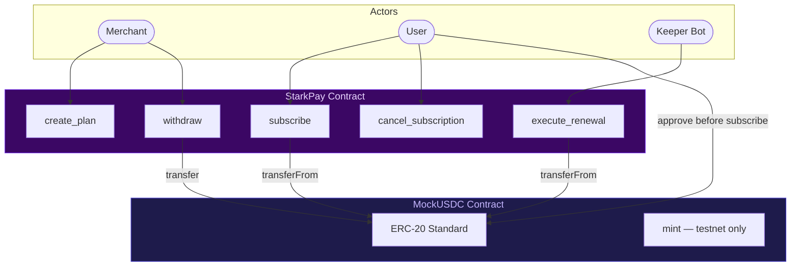
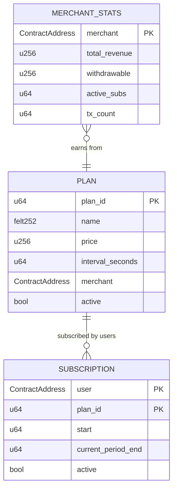

# Smart Contract Architecture

StarkPayHub is built on two Cairo contracts deployed to Starknet Sepolia.

---

## Contracts

| Contract | File | Purpose |
|---|---|---|
| `StarkPay` | `src/starkpay.cairo` | Core subscription protocol |
| `MockUSDC` | `src/mock_usdc.cairo` | Testnet USDC with public mint |

---

## Architecture



---

## Data Structures

```rust
// A subscription plan created by a merchant
struct Plan {
    name: felt252,        // short string (max 31 chars)
    price: u256,          // USDC amount in micro-units (6 decimals)
    interval: u64,        // billing interval in seconds
    merchant: ContractAddress,
    active: bool,
}

// A user's subscription to a plan
struct Subscription {
    plan_id: u64,
    start: u64,               // unix timestamp
    current_period_end: u64,  // unix timestamp
    active: bool,
}

// Merchant revenue stats
struct MerchantStats {
    total_revenue: u256,
    withdrawable: u256,
    active_subs: u64,
    tx_count: u64,
}
```

---

## Storage Layout



---

## Events

| Event | Fields | Emitted When |
|---|---|---|
| `PlanCreated` | `plan_id, merchant, price, interval` | New plan created |
| `SubscriptionCreated` | `user, plan_id, amount, period_end` | User subscribes |
| `RenewalExecuted` | `user, plan_id, amount, new_period_end` | Keeper renews successfully |
| `PaymentFailed` | `user, plan_id, reason` | Renewal fails — subscription deactivated |
| `SubscriptionCancelled` | `user, plan_id` | User cancels |
| `WithdrawalMade` | `merchant, amount` | Merchant withdraws |
| `TierLimitUpdated` | `plan_id, new_limit` | Owner updates tier plan limit |
| `ProtocolFeeWithdrawn` | `owner, amount` | Owner withdraws protocol fees |
| `ProtocolFeeUpdated` | `old_bps, new_bps` | Owner changes protocol fee rate |

---

## Key Design Decisions

### execute_renewal Deactivates on Payment Failure

If a user has insufficient USDC for renewal, `execute_renewal` sets `subscription.active = false`, decrements the merchant's subscriber count, and emits `PaymentFailed` — it does not `panic!`. This serves two purposes:

1. The keeper bot can batch renewals without a single failure halting the entire batch
2. The bot will not waste gas retrying the same failed subscription — `active = false` causes the next call to revert at the guard check

The user can re-subscribe at any time after topping up their USDC balance.

### Check-Before-Transfer Reentrancy Guard

`withdraw()` sets the merchant's withdrawable balance to zero **before** calling `IERC20Dispatcher.transfer`. This prevents reentrancy attacks.

### Tuple Key for Subscriptions

Subscriptions are stored at `Map<(ContractAddress, u64), Subscription>` using a composite key of `(user_address, plan_id)`. Each user can have at most one active subscription per plan.

### Protocol Fee

A 2% protocol fee (configurable by owner, max 10%) is deducted from every payment at the time of `subscribe` and `execute_renewal`. Merchants receive the remaining 98%. Fees accumulate in `protocol_balance` and are withdrawn separately by the owner via `withdraw_protocol_fee`.

### MockUSDC Faucet

`MockUSDC` inherits OpenZeppelin's `ERC20Component`. It has two mint paths:
- `claim_faucet()` — permissionless, mints 100 USDC once per wallet address
- `mint(to, amount)` — owner-only, used for server-side faucet top-ups
